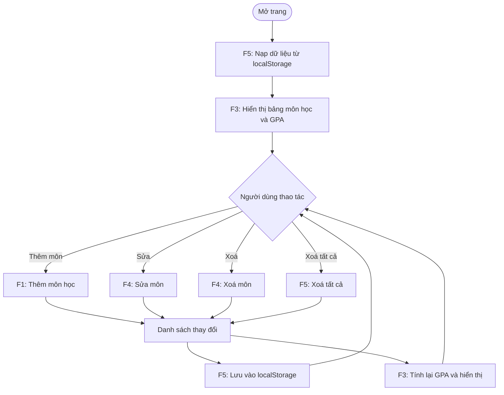
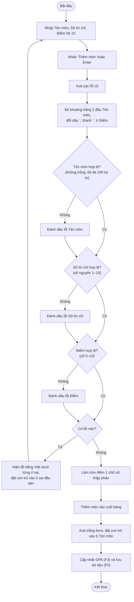
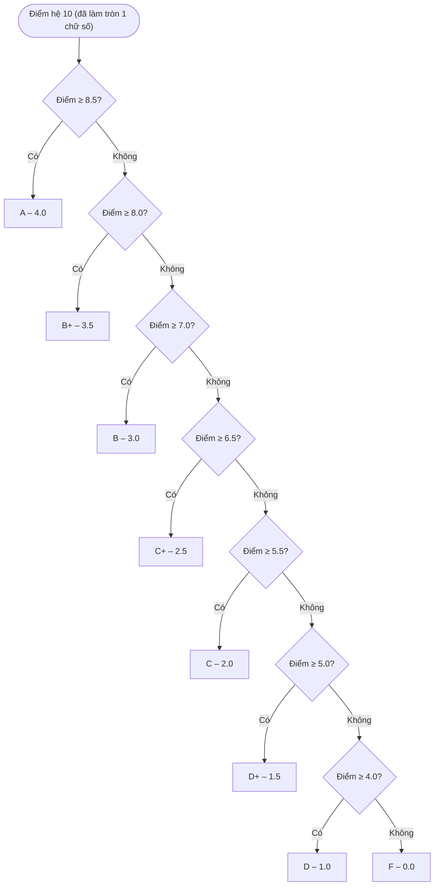
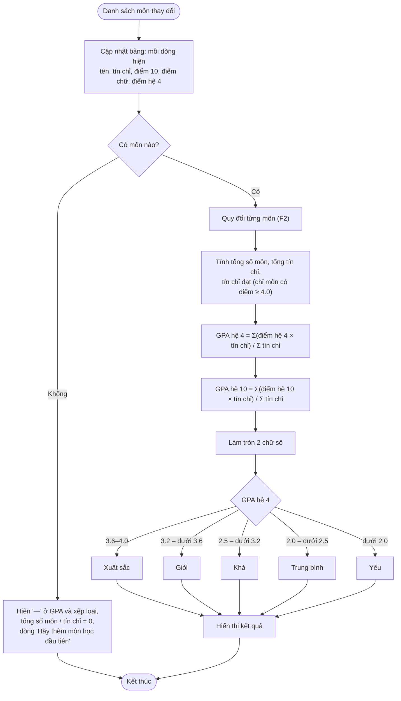
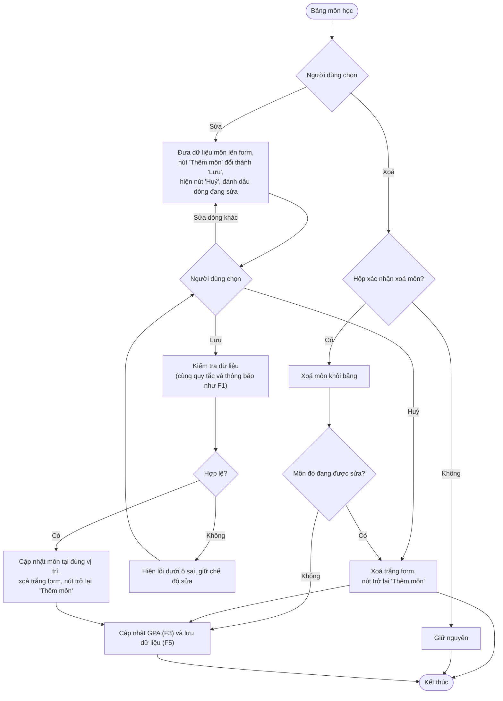

# Luồng nghiệp vụ – GPA Tracker

Thiết kế từ `PRD.md`, mỗi chức năng một flowchart (Mermaid). Chờ PM duyệt trước khi viết code.

## 0. Tổng quan luồng ứng dụng

Quy đổi điểm (F2) được F3 gọi cho từng môn, và được dùng để hiển thị điểm chữ / hệ 4 trên mỗi dòng của bảng.

## F1. Thêm môn học

Thông báo lỗi (tiếng Việt):

| Ô | Điều kiện | Thông báo |
|---|-----------|-----------|
| Tên môn | Trống | "Vui lòng nhập tên môn." |
| Tên môn | > 100 ký tự | "Tên môn tối đa 100 ký tự." |
| Số tín chỉ | Trống / không phải số nguyên / ngoài 1–10 | "Số tín chỉ phải là số nguyên từ 1 đến 10." |
| Điểm | Trống / không phải số / ngoài 0–10 | "Điểm phải là số từ 0 đến 10." |

## F2. Quy đổi điểm

Điểm được làm tròn 1 chữ số **trước** khi quy đổi (đã làm tròn ở F1).

## F3. Tính GPA và xếp loại

Lưu ý: môn điểm F vẫn được tính vào GPA (theo công thức PRD), chỉ không được tính vào tín chỉ đạt. Xếp loại xét trên GPA hệ 4 **đã làm tròn**.

## F4. Sửa và xoá môn học

## F5. Lưu dữ liệu

```mermaid
flowchart TD
    subgraph Tải["Khi mở trang"]
        A(["Mở trang"]) --> B["Đọc localStorage<br/>key 'gpa-tracker:v1'"]
        B --> C{"Đọc được<br/>(không lỗi truy cập)?"}
        C -- Không --> D["Danh sách rỗng"]
        C -- Có --> C2{"Có dữ liệu?"}
        C2 -- Không --> D
        C2 -- Có --> C3{"Đúng định dạng JSON<br/>và là danh sách?"}
        C3 -- Không --> D
        C3 -- Có --> C4["Giữ lại từng môn hợp lệ<br/>(tên, tín chỉ, điểm đúng quy tắc F1),<br/>bỏ môn sai"]
        C4 --> E["Nạp danh sách môn"]
        D --> F["Hiển thị bảng và GPA (F3)"]
        E --> F
    end

    subgraph Lưu["Khi có thay đổi"]
        G(["Thêm / sửa / xoá môn"]) --> H["Ghi danh sách vào localStorage"]
        H --> H1{"Ghi thành công?"}
        H1 -- Có --> H2(["Xong"])
        H1 -- "Không (đầy bộ nhớ / bị chặn)" --> H3["Hiện cảnh báo 'Không lưu được dữ liệu',<br/>vẫn dùng bình thường trong phiên này"]
    end

    subgraph Xoá["Xoá tất cả"]
        I(["Nhấn 'Xoá tất cả'"]) --> I1{"Danh sách có môn?"}
        I1 -- Không --> I2["Không làm gì (nút bị vô hiệu)"]
        I1 -- Có --> J{"Hộp xác nhận?"}
        J -- Không --> K["Giữ nguyên"]
        J -- Có --> L["Danh sách rỗng, thoát chế độ sửa (nếu có)"]
        L --> L2["Lưu (như nhánh 'Khi có thay đổi')<br/>và cập nhật GPA (F3)"]
    end
```

Dữ liệu mỗi môn: `{ id, name, credits, score }` (điểm lưu hệ 10, đã làm tròn; điểm chữ và hệ 4 luôn tính lại từ điểm, không lưu).

## Các quyết định thiết kế bổ sung (ngoài PRD)

| # | Quyết định | Lý do |
|---|-----------|-------|
| 1 | Báo lỗi **tất cả** ô sai cùng lúc, đưa con trỏ vào ô sai đầu tiên | PRD yêu cầu lỗi dưới từng ô; sửa một lần cho xong |
| 2 | Thêm nút "Huỷ" khi đang sửa | Tránh kẹt ở chế độ sửa |
| 3 | Xoá môn đang sửa thì thoát chế độ sửa | Tránh lưu nhầm vào môn đã mất |
| 4 | Khi nạp dữ liệu, bỏ từng môn sai thay vì bỏ cả danh sách | Giữ được tối đa dữ liệu của người dùng |
| 5 | Ghi localStorage lỗi thì cảnh báo, không chặn app | Đảm bảo không trắng trang |
| 6 | Nút "Xoá tất cả" vô hiệu khi danh sách rỗng | Tránh hộp xác nhận vô nghĩa |
